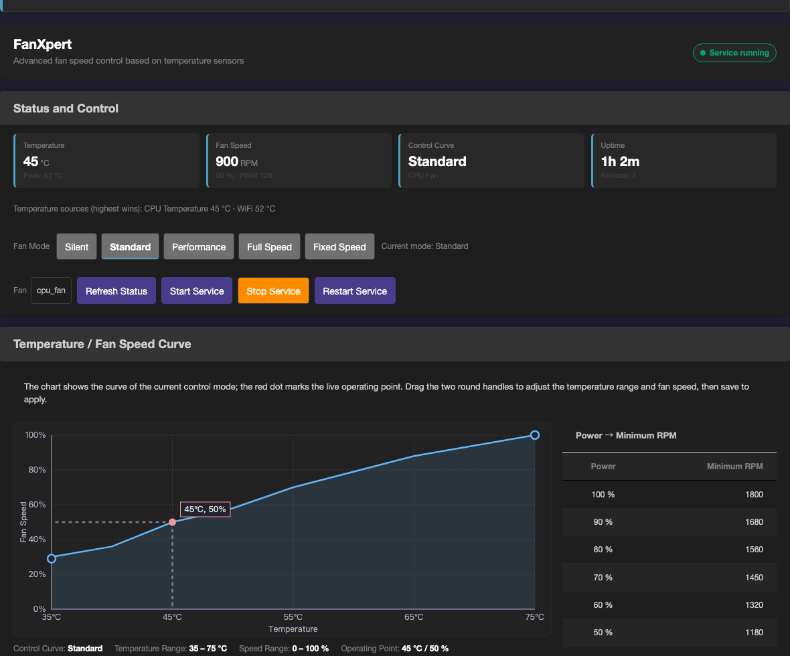
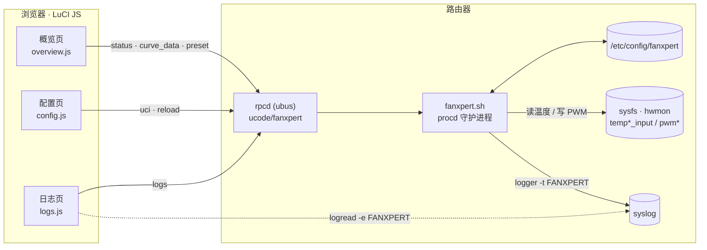
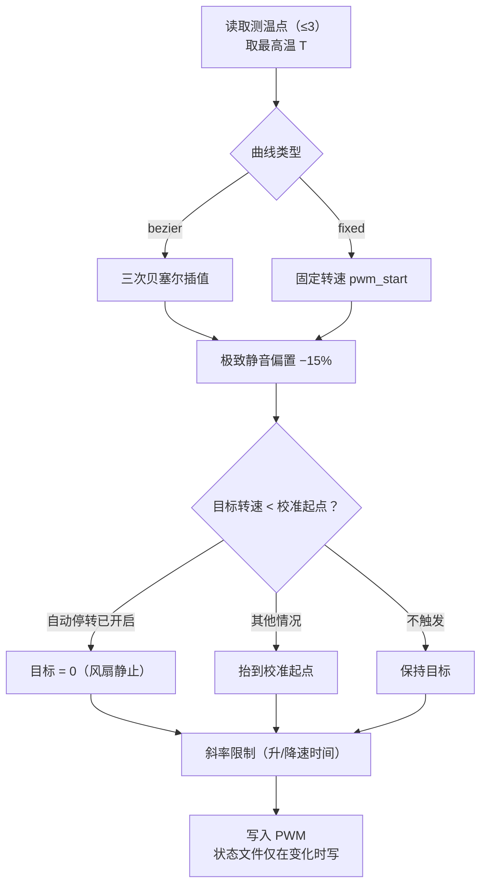
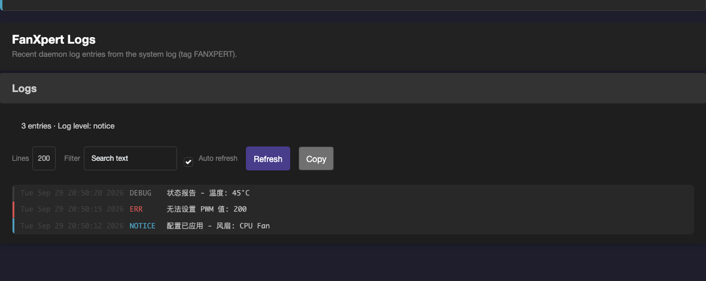

<div align="center">

# 🌀 LuciFanXpert

**面向 OpenWrt / immortalwrt 的 LuCI 风扇控制应用 —— 像华硕 Fan Xpert 4 那样调风扇**

读 `hwmon` 温度、写 `PWM` 控制器，按 UCI 里的温度‑转速曲线动态调速，并带一整套进阶控制（预设模式、曲线拖拽、升/降速时间、多测温点、极致静音、自动停转、固定转速）。

[](https://github.com/Shuery-Shuai/LuciFanXpert/actions/workflows/release.yml)
[](https://github.com/Shuery-Shuai/LuciFanXpert/releases)
[](#-许可证)


[功能](#-功能概览) · [架构](#-架构) · [快速开始](#-快速开始) · [界面](#-界面说明) · [配置](#-配置) · [开发与测试](#-开发与测试) · [故障排查](#-故障排查)

</div>

---



> [!NOTE]
>
> 项目已全面迁移到现代 OpenWrt / LuCI 技术栈：**LuCI JavaScript view**（无 Lua Controller / CBI / `.htm`）、**rpcd ucode 后端**（经 ubus 暴露接口）、**`menu.d` JSON 菜单**、**`rpcd/acl.d` 权限声明**、**procd** 守护进程、UCI 配置与 i18n 中文翻译。

## 📖 目录

- [功能概览](#-功能概览)
- [架构](#-架构)
- [关键算法](#-关键算法)
- [快速开始](#-快速开始)
- [安装](#-安装)
- [界面说明](#-界面说明)
- [配置](#-配置)
- [校准说明](#-校准说明)
- [开发与测试](#-开发与测试)
- [项目报告与流水线产物](#-项目报告与流水线产物)
- [故障排查](#-故障排查)
- [路线图](#-路线图)
- [已知限制](#-已知限制)
- [贡献](#-贡献)
- [许可证](#-许可证)

## ✨ 功能概览

**调速曲线**

- 🎚️ 基于温度的 PWM 控制，曲线类型支持**四种**：`bezier` 贝塞尔（平滑，三次插值，默认）/ `linear` 线性 / `step` 阶梯（档数可配 2-20，默认 5，避免温度临界点附近转速持续微调）/ `fixed` 固定转速
- 🎛️ 五条预设曲线：Silent 静音 / Standard 标准 / Performance 高性能 / Full Speed 全速 / Fixed 固定转速，可一键重置
- ⚡ 五档预设模式一键切换（静音 / 标准 / 高性能 / 全速 / 固定转速）：把当前模式套用到所有风扇，运行中的守护进程立即热重载
- ✏️ 自定义曲线：可添加、删除、命名，并在风扇控制模式中选用
- 🖱️ Canvas 曲线图：绘制温度‑PWM 曲线并标记实时工作点，两端锚点可直接**拖拽编辑**
- 📌 固定转速模式：曲线类型 `fixed`，风扇锁定在设定转速（温度不参与计算），拖动把手即可调整

**进阶控制**（与 Fan Xpert 4 对齐）

- 🔇 极致静音：在曲线基础上下调 15% 降噪，但绝不低于校准起点
- 💤 自动停转：目标转速低于校准起点时让风扇停转
- 🌡️ 多测温点：每个风扇最多绑定 3 个测温点，取其中**最高温**参与调速
- ⏱️ 升速 / 降速时间：以「从最低到最高转速所需秒数」限制每秒 PWM 变化量，避免转速突变
- 🧭 风扇启动阈值校准：服务停止时自动校准，兼容有 / 无转速反馈的硬件

> [!WARNING]
>
> 极致静音与自动停转都以**完成风扇校准**为前提（与 Fan Xpert 4 一致）。未校准时两项会被守护进程忽略，界面上对应开关为只读。

**界面与可观测性**

- 📊 实时状态面板：温度、PWM 百分比、当前曲线、服务运行时间（RPM 传感器存在时显示转速）
- 📈 功率 → 最低转速对照表：按功率档位统计观察到的最低转速
- 🪵 独立**日志页面**：读取系统日志里的 `FANXPERT` 行，按级别着色，支持行数选择、本地过滤、自动刷新与一键复制
- 🌗 深色 / 浅色自适应：跟随主题实际底色自动取色（兼容 argon 等第三方主题）
- 🇨🇳 完整中文界面翻译（`po/templates` + `po/zh_Hans`）

**工程化**

- 🔁 配置热重载：保存后守护进程自动重新应用曲线、PWM 路径、传感器路径、启动阈值与升/降速时间
- 💾 状态文件自适应写入：只在数值变化时或超过最小间隔才写（文件位于 `/tmp`，属 RAM 不磨损闪存，此项主要避免无意义的 CPU/IO 开销）
- 🔍 动态探测 PWM 最大值，适配非 255 范围的硬件
- ♻️ procd respawn 快速恢复（异常退出 60 秒内重启）
- 🔧 全离线自检：`tools/view-check.js`（137 项）+ `tools/daemon-check.sh`（128 项）+ `tools/package-check.sh`（14 项），不需要真机

## 🎯 目标环境

| 项 | 要求 |
| --- | --- |
| 系统 | OpenWrt 24.10 / 25.12，或较新的 immortalwrt snapshot |
| 依赖 | `luci-base`、`rpcd`、`rpcd-mod-ucode` |
| 温度输入 | 可读的 hwmon 温度（如 `/sys/class/hwmon/hwmon0/temp1_input`） |
| PWM 输出 | 可写的 PWM 控制器（如 `/sys/class/hwmon/hwmon1/pwm1`） |

默认配置以 `cpu_temp` 传感器与 `cpu_fan` 风扇为单设备模型。

## 🏗️ 架构



| 层 | 位置 | 职责 |
| --- | --- | --- |
| 视图 | `htdocs/luci-static/resources/view/fanxpert/*.js` | 概览 / 配置 / 日志三页，自包含 |
| 样式 | `htdocs/luci-static/resources/fanxpert/fanxpert.css` | 组件样式 + 深浅兜底调色板 |
| 接口 | `root/usr/share/rpcd/ucode/fanxpert` | ubus 方法：`status` `curve_data` `calibrate` `calibrate_progress` `preset` `logs` `reload` `start` `stop` `restart` |
| 权限 | `root/usr/share/rpcd/acl.d/luci-app-fanxpert.json` | 读写 UCI `fanxpert` 与上述 ubus 方法 |
| 菜单 | `root/usr/share/luci/menu.d/luci-app-fanxpert.json` | `系统 → FanXpert →（概览 / 配置 / 日志）` |
| 守护进程 | `root/usr/sbin/fanxpert.sh` | POSIX sh 控制循环 + 校准 + 日志命令 |
| 服务 | `root/etc/init.d/fanxpert` | procd 管理，`fanxpert.sh run` |
| 配置 | `root/etc/config/fanxpert` + `root/etc/uci-defaults/80_fanxpert` | 默认值初始化与升级补齐 |

### 项目结构

```text
.
├── .github/workflows/release.yml     # 构建 APK / IPK 并发布 Release
├── docs/images/                      # README 截图
├── luci-app-fanxpert
│   ├── Makefile
│   ├── htdocs/luci-static/resources
│   │   ├── fanxpert/fanxpert.css
│   │   └── view/fanxpert
│   │       ├── overview.js
│   │       ├── config.js
│   │       └── logs.js
│   ├── po
│   │   ├── templates/fanxpert.pot
│   │   └── zh_Hans/fanxpert.po
│   └── root
│       ├── etc
│       │   ├── config/fanxpert
│       │   ├── init.d/fanxpert
│       │   └── uci-defaults/80_fanxpert
│       └── usr
│           ├── sbin/fanxpert.sh
│           └── share
│               ├── luci/menu.d/luci-app-fanxpert.json
│               └── rpcd
│                   ├── acl.d/luci-app-fanxpert.json
│                   └── ucode/fanxpert
└── tools                             # 离线自检与部署工具
    ├── deploy-test.sh                # 开发机直连部署（含翻译编译与缓存失效）
    ├── view-check.js
    ├── daemon-check.sh
    ├── common-block.js
    ├── sync-common.js
    ├── po2lmo.py
    └── fanxpert-diag.html
```

## 🧮 关键算法

百分比与 PWM 的换算（**截断**而非四舍五入，前端 JS 与本公式逐位对齐）：

$$
\mathrm{PWM}(p) = \left\lfloor \frac{(PWM_{\max} - PWM_{\min}) \cdot p}{100} \right\rfloor + PWM_{\min}
$$

贝塞尔曲线（控制点取 $p_0 + 10$ 与 $p_1 - 10$；起止百分比相同时直接输出该值，避免全速档中段塌陷）：

$$
p(u) = (1-u)^3 p_0 + 3(1-u)^2 u\,(p_0 + 10) + 3(1-u)u^2\,(p_1 - 10) + u^3 p_1,
\qquad u = \frac{T - T_{\min}}{T_{\max} - T_{\min}}
$$

线性插值：

$$
p(u) = p_0 + \left\lfloor (p_1 - p_0)\,u 
ight
floor,
\qquad u = rac{T - T_{\min}}{T_{\max} - T_{\min}}
$$

阶梯曲线（把温度区间等分为 $N$ 档，$N$ 由 `step_levels` 配置（2-20，默认 5）；档位内转速保持不变）：

$$
p(u) = p_0 + \left\lfloor rac{(p_1 - p_0)\,k}{N} 
ight
floor,
\qquad k = \left\lfloor N\,u 
ight
floor + 1
$$

多测温点取最高温：$T = \max_i T_i$

极致静音偏置（不低于校准起点）：$p' = p - \left\lfloor 0.15\,p \right\rfloor$

升速 / 降速斜率限制（$T_{\text{ramp}}$ 为配置秒数，0 表示不限制）：

$$
\Delta_{\max} = \left\lceil \frac{PWM_{\max} - PWM_{\min}}{T_{\text{ramp}}} \right\rceil \quad [\text{PWM} \cdot \mathrm{s}^{-1}]
$$



> [!NOTE]
>
> 守护进程使用 BusyBox POSIX sh 的**整数运算**，公式中的除法均为截断；前端预览曲线用同一套整数运算复算，保证图上看到与风扇实际执行的一致。

## 🚀 快速开始

```shell
# 1. 安装包（APK 系统；OPKG 系统用 opkg install）
apk add --allow-untrusted ./luci-app-fanxpert-*.apk

# 2. 初始化配置（首次安装会自动执行，也可手动跑一次）
sh /etc/uci-defaults/80_fanxpert

# 3. 启用并启动服务
/etc/init.d/fanxpert enable
/etc/init.d/fanxpert start

# 4. 查看状态
/usr/sbin/fanxpert.sh status
```

> [!TIP]
>
> 装完打开 LuCI：**系统 → FanXpert**。若页面显示旧界面，见[故障排查](#-故障排查)的缓存说明。

## 📦 安装

### 从 Release 安装（推荐）

1. 在 [Releases](https://github.com/Shuery-Shuai/LuciFanXpert/releases) 下载与设备包管理器匹配的包：
   - `luci-app-fanxpert-*.apk`（OpenWrt 25.12+ / APK）
   - `luci-app-fanxpert-*.ipk`（OpenWrt 24.10 / OPKG）
   - `luci-i18n-fanxpert-zh-cn-*.{apk,ipk}`（中文语言包）
2. 上传到路由器后安装（APK 示例）：

```shell
apk add --allow-untrusted ./luci-app-fanxpert-*.apk ./luci-i18n-fanxpert-zh-cn-*.apk
```

### 从源码构建

```shell
# 在 OpenWrt / immortalwrt SDK 根目录
echo "src-link fanxpert /path/to/LuciFanXpert" >> feeds.conf.default
./scripts/feeds update fanxpert && ./scripts/feeds install luci-app-fanxpert
make package/luci-app-fanxpert/compile V=s
```

> [!IMPORTANT]
>
> 包声明了 conffiles（`/etc/config/fanxpert`），**升级不会覆盖你的配置**；新增字段由守护进程启动时的 `ensure_uci_config()` 与 `uci-defaults` 自动补齐。

### 开发机直连部署

```shell
OPENWRT_HOST=192.168.0.1 DEPLOY_FORCE=1 ./tools/deploy-test.sh
```

`tools/deploy-test.sh` 会：编译并安装中文翻译（`.lmo`）→ 复制 `root/` 与 `htdocs/` → 清理迁移后残留的旧文件 → 重启 rpcd / 服务 → **更新 LuCI 资源版本号**（让浏览器重新拉取前端资源）→ 打印服务状态与最近日志。

> [!CAUTION]
>
> `tools/deploy-test.sh` 是**测试用开发工具**，会直接写入路由器的系统目录（含清缓存、重启服务）。生产环境请用 Release 包安装。

## 🖥️ 界面说明

界面分三页（菜单：**系统 → FanXpert → 概览 / 配置 / 日志**），三个视图都在 `resources/view/fanxpert/` 下且**各自自包含**。

### 概览

- 状态徽标 + 四张指标卡（温度 / 风扇转速 / 控制曲线 / 运行时间）
- 测温点实时读数行（多测温点时显示各自温度，取最高值参与调速）
- 模式行：静音 · 标准 · 高性能 · 全速 · 固定转速（一键套用到所有风扇）
- 风扇选择器与服务按钮（刷新状态 / 启动服务 / 停止服务 / 重启服务）
- 温度‑转速曲线图（可拖拽锚点）+ 功率 → 最低转速对照表
- 风扇启动阈值校准（需先停止服务）

### 配置

- **全局设置**：启用开关、日志级别
- **风扇设备**（基础 / 硬件两个选项卡）：曲线选择、名称、启动阈值、校准来源与时间、极致静音、自动停转、升速时间、降速时间、测温点、PWM 控制器
- **预设曲线 / 自定义曲线**：曲线类型（贝塞尔 / 线性 / 阶梯 / 固定转速）、阶梯档数、温度区间与转速区间
- **自定义曲线**：可添加、命名并设置温度/PWM 范围

保存后由守护进程热重载（`fanxpert.reload`）并给出提示。

### 日志



读取系统日志中 tag 为 `FANXPERT` 的行，按级别着色（err 红 / warn 黄 / notice 蓝 / info·debug 灰），支持行数选择（100/200/500）、本地过滤、自动刷新（5 秒，可关闭）与一键复制。

## 🛠️ 配置

配置文件：`/etc/config/fanxpert`

### 全局

| 选项 | 默认 | 说明 |
| --- | --- | --- |
| `settings.enabled` | `1` | 是否启用守护进程 |
| `settings.log_level` | `info` | `err` / `warn` / `notice` / `info` / `debug` |

### 风扇（`config fan`）

| 选项 | 默认 | 说明 |
| --- | --- | --- |
| `enabled` | `1` | 该风扇是否受控 |
| `label` | — | 显示名称 |
| `curve` | `standard` | 使用的曲线段 |
| `pwm_path` | `auto` | PWM 控制器路径，`auto` 为自动探测 |
| `pwm_min_start` | `0` | 校准得到的启动阈值（%），0 表示未校准 |
| `pwm_min_start_source` | `unknown` | `measured` / `estimated` / `unknown`，前两者视为已校准 |
| `pwm_min_start_timestamp` | `0` | 校准时间戳 |
| `sensors` | `cpu_temp` | 测温点列表（最多 3 个，取最高温） |
| `quiet_mode` | `0` | 极致静音（需已校准） |
| `auto_stop` | `0` | 自动停转（需极致静音 + 已校准） |
| `ramp_up_time` | `30` | 升速时间（秒），0 不限制 |
| `ramp_down_time` | `120` | 降速时间（秒），0 不限制 |
| `never_stop` | `1` | 兼容旧配置：不允许停转 |

### 曲线（`config curve`）

| 选项 | 说明 |
| --- | --- |
| `type` | `bezier` 贝塞尔（平滑，默认）/ `linear` 线性 / `step` 阶梯（档数由 `step_levels` 决定）/ `fixed` 固定转速（只用 `pwm_start`） |
| `sensor` | 曲线绑定的测温点（多测温点时以风扇的 `sensors` 为准） |
| `temp_min` / `temp_max` | 曲线生效的温度区间（°C） |
| `pwm_start` / `pwm_end` | 区间两端的转速（%） |

### 测温点（`config sensor`）

| 选项 | 说明 |
| --- | --- |
| `type` | `hwmon` |
| `platform` | 传感器基路径（如 `/sys/class/hwmon/hwmon0/temp1`），`auto` 为自动探测 |
| `label` | 显示名称 |

### 命令行

```shell
/usr/sbin/fanxpert.sh start|stop|restart|reload|status   # 服务控制（reload = 热重载配置）
/usr/sbin/fanxpert.sh info [fan]                  # 实时数据（JSON）
/usr/sbin/fanxpert.sh logs [lines]                # 最近日志（JSON，默认 100 行）
/usr/sbin/fanxpert.sh curve-data [fan]            # 曲线点与参考表
/usr/sbin/fanxpert.sh calibrate [fan]             # 启动阈值校准（需先停服务）
/usr/sbin/fanxpert.sh preset <mode>               # 套用预设模式（silent/standard/performance/full_speed/fixed）
/usr/sbin/fanxpert.sh reset-curve <id>            # 重置某条预设曲线为默认值
/usr/sbin/fanxpert.sh run                         # 前台运行（由 procd 调用）
```

## 🧭 校准说明

校准用于自动测定风扇开始稳定转动的最低 PWM 百分比（`pwm_min_start`），并写入 UCI 配置（`pwm_min_start` + `pwm_min_start_source` + `pwm_min_start_timestamp`）。

- **有转速反馈**（检测到 `fan*_input`）：逐步增加 PWM 并观察 RPM 变化，精确定位启动点，结果标记为 `measured`
- **无转速反馈**：采用保守估算（在 25% PWM 附近寻找启动点），结果标记为 `estimated`

> [!IMPORTANT]
>
> 校准前**必须停止服务**（页面按钮或 `/etc/init.d/fanxpert stop`）。校准过程中会先把风扇降到 0，再逐步升速，完成后自动恢复校准前的 PWM。

- 进度可在概览页的校准卡片实时查看（`calibrate_progress`）
- 没有转速传感器时结果为估算值，建议结合实际噪声与散热情况手动微调
- 服务启动时会清理上次残留的校准进度文件，避免页面显示过时结果

## 🧪 开发与测试

真机联调慢，日常改动请先在本地拦住问题。两个自检脚本都是**全离线**的，不需要路由器：

```shell
node tools/view-check.js      # 137 项：结构、模块契约、依赖声明、曲线数学、拖拽、模式切换、翻译覆盖、纯函数
sh tools/daemon-check.sh      # 128 项：采样、斜率、热重载、多测温点、静音/停转、预设、日志、命令层、输入校验
sh tools/package-check.sh     #  打包自检：脚本执行位 / conffiles / JSON（可带 PKG_ARTIFACT=<包> 校验产物内部）
```

> [!IMPORTANT]
>
> `view-check.js` 会像 LuCI 一样**只注入视图源码里 `'require ...'` 声明过的依赖**（在独立 realm 中求值）。漏写依赖会在本地直接报 `xxx is not defined`，而不是等真机才发现。

### 工具链

| 工具 | 用途 |
| --- | --- |
| `tools/common-block.js` | 三个视图共用的公共代码**单一来源**（构建期注入，运行期不依赖跨文件模块） |
| `tools/sync-common.js` | 把公共块同步进各视图；`--check` 校验同步（测试会自动跑） |
| `tools/po2lmo.py` | PO → LuCI `.lmo` 编译器（输出与官方 `po2lmo` 逐字节一致，无需 SDK） |
| `tools/package-check.sh` | **打包自检**：源文件与安装包内脚本的执行位、conffiles、JSON 合法性（发布工作流已接入，缺失即构建失败） |
| `tools/fanxpert-diag.html` | 浏览器自检页：校验资源版本、模块内容、真实加载器能否加载三个视图并调用 `load()` |
| `tools/view-check.js --html out.html` | 生成离线排版预览（真实标记 + 真实 CSS + 真实绘图函数） |

### 离线渲染预览

```shell
# 默认主题
node tools/view-check.js --html tmp/preview.html

# 指定主题 CSS（例如 argon）与深浅模式
node tools/view-check.js --no-banner \
  --theme-css /path/to/argon/css/cascade.css,/path/to/argon/css/dark.css \
  --html tmp/preview-argon.html
```

生成后用浏览器打开，可加 `?dark=1` / `?dark=0` 强制深浅配色。

### 本地测试环境选择

| 场景 | 手段 | 覆盖 |
| --- | --- | --- |
| 改 JS 逻辑 / 结构 | `node tools/view-check.js` | 模块契约、依赖声明、render 结构、曲线数学（四种曲线类型）、拖拽、模式切换 |
| 改守护进程逻辑 | `sh tools/daemon-check.sh` | 采样、斜率、热重载、测温点、静音/停转、预设、日志 |
| 想看真实渲染 / 真实加载器 | 把 `tools/fanxpert-diag.html` 放到能提供 `luci-static` 的地址后用浏览器打开 | 资源版本、模块内容、真实加载器加载 |
| 需要整机全真 | OpenWrt 容器或虚拟机（`docker run --privileged --platform linux/arm64 openwrt/rootfs:armsr-armv8` 后 `apk add --allow-untrusted ./luci-app-fanxpert-*.apk`，或官方 qemu 镜像） | 打包、ACL、rpcd、init、procd 全链路 |

## 🩺 故障排查

### 安装时报 `uci: Entry not found` / `Permission denied`

旧版本的包没有携带 `/etc/config/fanxpert`，且 `init.d`、`fanxpert.sh` 没有可执行位，导致 postinst 阶段报错。现已修复（包内携带配置 + conffiles 声明 + 脚本 100755）。手工修复：

```shell
touch /etc/config/fanxpert
chmod 755 /etc/init.d/fanxpert /usr/sbin/fanxpert.sh
/etc/uci-defaults/80_fanxpert
```

### 安装后服务不自启、风扇完全不受控

**症状**：`/etc/init.d/fanxpert: Permission denied`；`/etc/rc.d/` 下没有 `S99fanxpert`；
`/tmp/fanxpert.state` 不存在；`logread | grep FANXPERT` 为空；PWM 停在硬件默认值。

**原因**：包内 `/etc/init.d/fanxpert`、`/usr/sbin/fanxpert.sh` 在执行 `default_postinst` 时
缺少可执行位（历史发布件 `0.1.0_alpha2` 即为此问题），`enable`/`start` 两步直接失败 —— 重启后风扇失控。

**修复**（三层，缺一不可）：

```shell
# 1) 设备侧立即恢复
chmod 755 /etc/init.d/fanxpert /usr/sbin/fanxpert.sh
/etc/init.d/fanxpert enable && /etc/init.d/fanxpert start

# 2) 仓库侧：随包脚本的 git 模式必须为 100755（新增自检会拦住回归）
git ls-files -s luci-app-fanxpert/root/etc/init.d/fanxpert   # 期望 100755
sh tools/package-check.sh                                    # 打包自检

# 3) 安装自愈：uci-defaults 在 enable/start 之前补回可执行位（升级旧包时自动修复）
```

> [!NOTE]
>
> `tools/package-check.sh` 已接入发布工作流：构建前校验源文件模式、构建后**解包**校验产物内部模式，
> 任一不通过即构建失败。自愈逻辑写在 `root/etc/uci-defaults/80_fanxpert` 开头，且**必须在脚本提前退出之前**，
> 否则"配置已存在"的升级场景不会执行（该顺序同样由 `package-check.sh` 断言）。

### 部署后页面还是旧版

两种常见原因：

1. **浏览器缓存了旧 JS/CSS。** LuCI 的资源版本号 = `luci` 包版本 + **包数据库 mtime**（`runtime.uc` 的 `pkgs_update_time`）。只复制前端文件不会改变它，浏览器就会一直复用旧文件——**光刷新没用**。`tools/deploy-test.sh` 会 `touch` 包数据库让版本号变化，普通刷新即可；手动等价命令：

   ```shell
   touch /lib/apk/db/installed     # opkg 系统用 touch /usr/lib/opkg/status
   rm -rf /tmp/luci-indexcache.*
   ```

2. **守护进程还在跑旧脚本。** 进程只在启动时读一次 `/usr/sbin/fanxpert.sh`，覆盖文件后必须 `restart` 才会加载新逻辑并补齐新的 UCI 字段：

   ```shell
   /etc/init.d/fanxpert restart
   uci show fanxpert | grep -c sensors    # 确认新字段已补齐
   ```

> [!WARNING]
>
> 站点前面若挂了 Cloudflare 之类的 CDN，它可能给 `.js` 加上 `Cache-Control: max-age=14400`（4 小时）。此时即使版本号变了，Safari 等浏览器也可能在 4 小时内不发请求。临时办法：无痕窗口打开、清空缓存，或在页面 URL 后加任意参数（如 `?cb=2`）。

### 页面报 `factory yields invalid constructor` / `xxx is not defined`

`luci.js` 会对模块工厂做 `Class.isSubclass()` 校验，因此**共享代码不要做成跨文件模块**；同时它的依赖扫描器**遇到第一个既不是 `'require ...'` 也不是 `'use strict'` 的字符串就停止扫描**，公共代码若插在 `'require ...'` 中间，后面的依赖不会被注入。

- 共享代码请用 `node tools/sync-common.js` 注入（会自动放在所有 `require` 之后，`--check` 与 `view-check` 强制这条不变量）
- LuCI 是**单页应用**：某个模块一旦加载失败，本次页面会话里会一直复现，修好后必须**整页刷新**

### 界面部分文案是英文

翻译来自 `/usr/lib/lua/luci/i18n/fanxpert.zh-cn.lmo`（**只存译文、不存 msgid**，所以用 `strings` 查英文原文查不到，属正常）：

```shell
ls -l /usr/lib/lua/luci/i18n/fanxpert.zh-cn.lmo   # 旧版本会明显偏小
uci get luci.main.lang                            # auto = 跟随浏览器语言
```

开发部署时 `tools/deploy-test.sh` 会重新编译安装；正式安装来自 `luci-i18n-fanxpert-zh-cn` 包，升级该包即可。

### 服务在运行但没有开机自启

```shell
/etc/init.d/fanxpert enable        # 创建 /etc/rc.d/S99fanxpert
ls /etc/rc.d/ | grep fanxpert
```

`tools/deploy-test.sh` 会在检测到「服务正在运行但没有自启」时给出警告。

## 📊 项目报告与流水线产物

以下文件由本地流水线生成（**未纳入版本库**，在克隆下来的仓库中不存在）：

| 文件 | 内容 |
| --- | --- |
| `PROJECT_REPORT.md` | 项目报告：技术栈与许可证合规、需求分析、架构与算法设计、关键实现、系统测试、总结与展望 |
| `reports/license_check_report_*.md` | 许可证清单与合规建议（Apache-2.0，无第三方依赖） |
| `reports/syntax_report_*.md` | 严格语法检查（`shellcheck enable=all`）明细与逐条处置理由 |
| `reports/unit_test_generation_*.md` | 单元测试补充说明与覆盖率缺口分析 |
| `reports/performance_report_*.md` | 性能基线（空闲 CPU、控制循环节拍、RPC 延迟、内存） |
| `reports/fix_report_*.md` | 缺陷修复记录（含真机复现步骤与回归用例） |
| `reports/cicd_report_*.md` | CI/CD 流水线执行汇总 |

## ⚠️ 已知限制

- **控制循环目前只驱动 `cpu_fan`**：配置与预设模式会套用到所有 `config fan` 段，但守护进程的主循环固定使用 `cpu_fan`，界面的风扇选择器只切换*查看*对象，多风扇并行控制尚未实现。
- 无 RPM 反馈时校准为保守估算，精度有限。
- 自动硬件检测覆盖常见 `hwmon` 命名，非标准平台仍需手动指定 `platform` / `pwm_path`。
- 极致静音 / 自动停转依赖校准结果：未校准时守护进程会忽略这两个开关，并在日志中说明原因。

## 🗺️ 路线图

- [x] 安装修复与打包（配置随包、conffiles、脚本可执行位）
- [x] 页面重做，对齐 Fan Xpert 4 的信息结构
- [x] RPM 显示与功率 → 最低转速对照表
- [x] 四档预设模式一键切换
- [x] 曲线拖拽编辑
- [x] 升速 / 降速时间（斜率限制）
- [x] 多测温点（≤3 取最高）
- [x] 极致静音 / 自动停转（校准前置）
- [x] 固定转速模式
- [x] 三页结构（概览 / 配置 / 日志）
- [x] 深色主题适配（含 argon 等第三方主题）
- [ ] 多风扇 / 多传感器完整编排
- [ ] 温度曲线历史记录与图表

## 🤝 贡献

欢迎 Issue 与 PR。提交前请确保本地自检通过：

```shell
node tools/view-check.js && sh tools/daemon-check.sh
```

- 提交信息沿用仓库现有风格（gitmoji + Conventional Commits），例如 `🐞 fix(fanxpert): …`、`📃 docs(README): …`
- 修改 UI 文案后请同步 `po/templates/fanxpert.pot` 与 `po/zh_Hans/fanxpert.po`（`view-check` 会校验是否漏词条）
- 修改共享代码请改 `tools/common-block.js` 后执行 `node tools/sync-common.js`

## 📄 许可证

[Apache-2.0](LICENSE)（仓库根目录 `LICENSE`；`luci-app-fanxpert/Makefile` 中声明 `PKG_LICENSE:=Apache-2.0` 与 `PKG_LICENSE_FILES:=LICENSE`）。

> [!NOTE]
>
> 本项目**不引入任何第三方库**，因此不存在依赖许可证冲突；平台组件（LuCI / rpcd / procd）由发行版镜像提供，不随本仓库分发。

## ⭐ 致谢

- 交互与功能参照华硕 **Fan Xpert 4**（[ASUS FAQ 1050426](https://www.asus.com.cn/support/faq/1050426/)）
- 基于 [OpenWrt](https://openwrt.org/) / [LuCI](https://github.com/openwrt/luci) 与 [immortalwrt](https://github.com/immortalwrt) 构建
